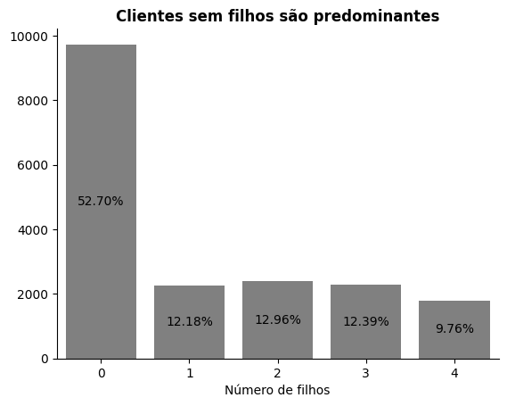
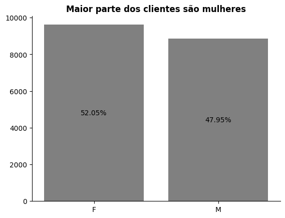
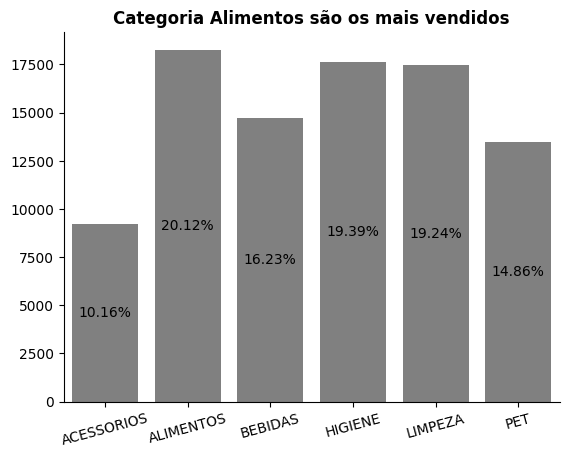
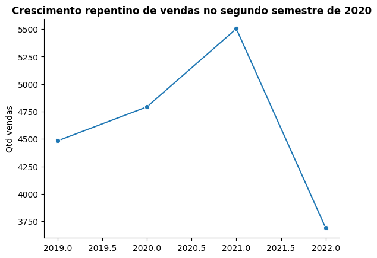
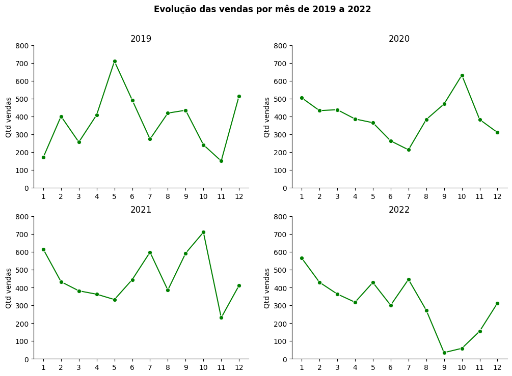

# miniprojeto-RuanCarlosCostaGuths-T2

## Indicação

Os arquivos estão no formato .ipynb (notebooks)
Utilize o Google Colab ou instale a extensão do Jupyter Notebook no seu VSCode

## Objetivo

Importar, tratar e analisar dados de vendas de um varejo.

## Tecnologias usadas

- VSCode
- Python
- Pandas
- MatPlotLib
- Seaborn

## Dataset

O dataset trabalho contem as vendas de um varejo do período de 2019 a 2022, com informações sobre:
- Compras
- Clientes
- Produtos
- Categorias de produtos

## Limpeza e tratamento

1. Remoção de colunas vazias
2. Conversão da coluna DATA para datetime e das colunas CO_ID, CL_ID e PR_ID para string
3. Tratamento de valores nulos

## Principais insights

### Perfil dos clientes

- 52.70% dos clientes não possuem filhos
- A relação do cliente ter filho ou não tem maior impacto do que a quantidade de filhos
- 52.05% dos clientes são femininos

### Análise das categorias de produtos

- A categoria de Alimentos representa a maior parte das vendas, com 20.12%, seguida das categorias Higiene (19.39%) e Limpeza (19.24%), representando, juntas, mais de 60% de todas as vendas.
- A categoria Acessórios possui a menor participação, com 10.16% do total. 

### Análise da evolução das vendas entre 2019 a 2022

- Grande crescente das vendas entre 2020 e 2021, seguida de uma brusca queda no ano seguinte
- Novembro possui uma tendência de queda nas vendas entre todos os anos estudados

